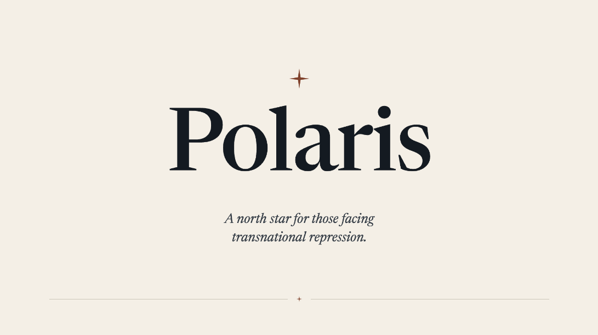

<p align="center">
  
</p>

# Polaris

**Transnational repression, on the record.**

Polaris is a small, privacy-preserving web app for individuals from the Hong Kong, Tibetan, Uyghur, and mainland Chinese communities — and for allies in the United States — who continue to experience the Chinese Communist Party's transnational repression.

It is built to feel like a page from a thoughtful field guide rather than a panic app: steady, plainly written, and respectful of the reader as a capable adult who is already thinking carefully.

## What you can do with it

- **Assess your risk.** Ten short questions about your situation, asked one at a time, with a calm read of your exposure and a few practical steps to consider next.
- **Report an incident.** A structured place to put down what happened — when, where, and what you remember — one section at a time. You decide whether to share contact details for follow-up. No account required.
- **See the public overview.** An aggregate map and a few summary statistics drawn from community reports. No individual report or location is shown.

## What is transnational repression?

When foreign governments seek to intimidate, silence, coerce, harass, or harm members of diaspora and exile communities, it is known as [transnational repression](https://www.fbi.gov/investigate/counterintelligence/transnational-repression). It can take the form of stalking, online disinformation, harassment, threats, coerced returns, threats against family in the country of origin, abusive legal practices, cyberhacking, assault, attempted kidnapping, and worse.

## Tech stack

- **Next.js 16** (App Router) + **React 19** + **TypeScript**
- **Tailwind CSS 4** for styling
- **Supabase** for Postgres, Auth (magic links for the research surface), and preview branching
- **Cloudflare Turnstile** to gate report submissions against abuse
- **Tinfoil** for private inference (voice transcription, incident analysis, narrative blinding)
- **Vercel** for hosting and scheduled jobs (Vercel Cron)
- **Vitest** for unit tests

## Run it locally

You'll need Node.js 20+ and `npm`.

```bash
git clone https://github.com/ATLBitLab/polaris.git
cd polaris
npm install
cp .env.example .env.local
npm run dev
```

Open <http://localhost:3000>. The home page links to the safety quiz and the incident report flow.

The app runs without any environment variables filled in, but several features (Supabase analytics writes, the research dashboard, Turnstile, Tinfoil-powered analysis) are no-ops until you provide credentials. See [`AGENTS.md`](./AGENTS.md) for the full environment, Supabase, and operations reference.

## More documentation

- [`AGENTS.md`](./AGENTS.md) — agent rules and the deeper technical reference (environment variables, Supabase setup, branching, quiz internals).
- [`PRODUCT.md`](./PRODUCT.md) — who Polaris is for and what it is trying to do.
- [`DESIGN.md`](./DESIGN.md) — the design system and visual language.
